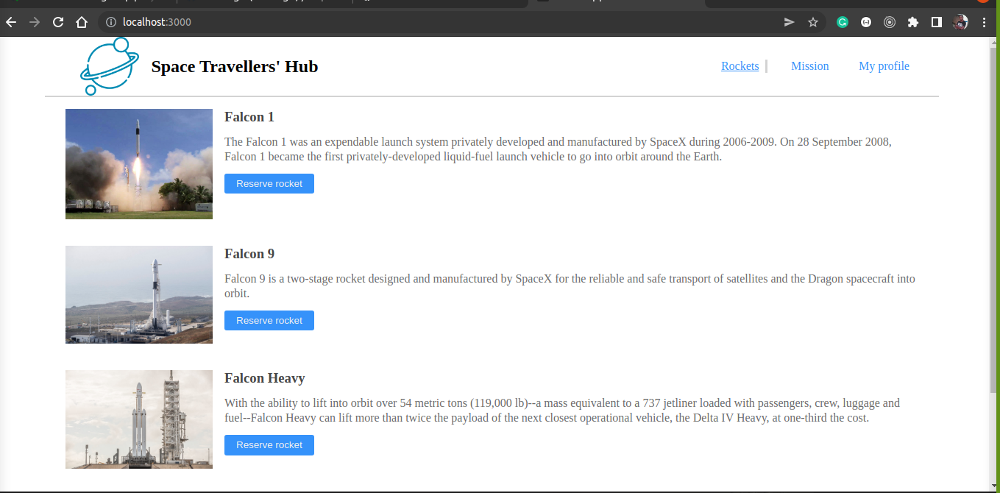
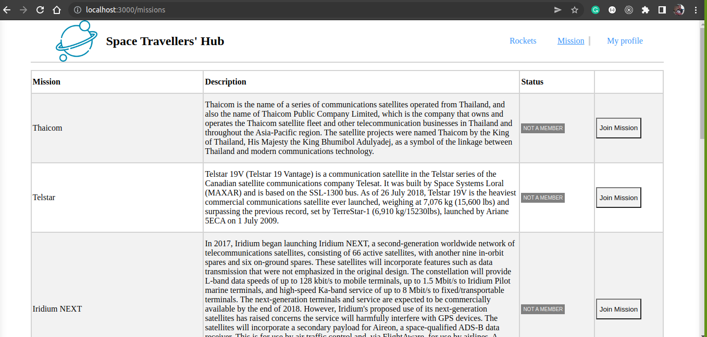
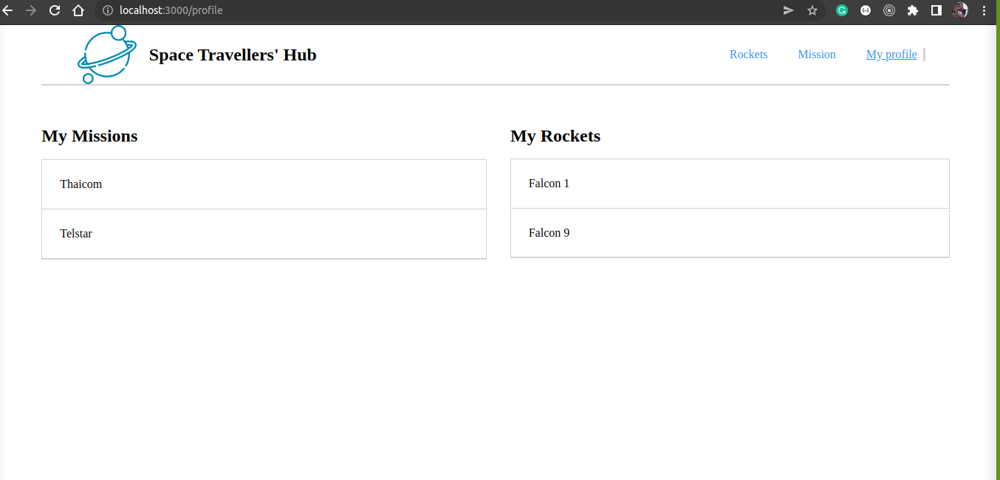

#Project: Space Travelers

## Built with

- React js
- Redux
- Lots of love :heart:


## Getting Started

To get a local copy up and running follow these simple example steps.

## Setup

- Clone this repository. 
- Navigate to the project folder (Library)
- Run `npm install` command
- Run `npm start` command

## Screenshots





## Run Tests

```
npm run test
```

```
npx eslint .
```
```
npx stylelint "**/*.{css,scss}"
```

## Authors:

 **Daniel URIMUBENSHI**

[<code></code>](https://github.com/benshidanny11)
[<code></code>](https://twitter.com/DBenshi)
[<code></code>](https://www.linkedin.com/in/daniel-urimubenshi-077162185/)
<a href="mailto:benshidanny11@gmail.com?subject=Hello Danny!"></a>

 **Kanombola Kanombola**

[<code></code>](https://github.com/KanoCode)
[<code></code>](https://twitter.com/Kanombola_s)
[<code></code>](https://www.linkedin.com/in/kanombola-kanombola/)
<a href="mailto:benshidanny11@gmail.com?subject=Hello Danny!"></a>


##  Contributing

Contributions, issues and feature requests are welcome!

Feel free to check the [issues page](https://github.com/benshidanny11/space-travelers/issues).

## Show your support

Give a 👍 if you like this project!

## Acknowledgments

- Microverse

## 📝 License

This project is [MIT](./LICENSE.md) licensed.